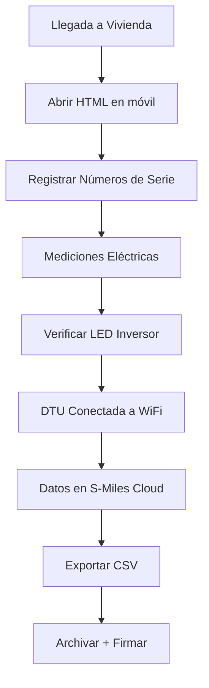

# 📋 Los Lirios - Registro de Instalación FV Hoymiles

> **Sistema de registro técnico para instalaciones de kits fotovoltaicos Hoymiles HMS-1600-4T**  
> Proyecto: Los Lirios | Arrecife, Lanzarote | España

[](LICENSE)
[]()
[]()

---

## 🎯 Descripción

Herramientas profesionales para documentar e instalar 60 kits fotovoltaicos completos con tecnología **Hoymiles HMS-1600-4T** en el proyecto residencial **Los Lirios** de Lanzarote.

### Características principales:
- ✅ Registro en tiempo real sin necesidad de internet
- ✅ Almacenamiento local de datos en navegador
- ✅ Exportación automática a CSV/Excel
- ✅ Formulario completo para todos los componentes
- ✅ Verificación técnica integrada
- ✅ Estadísticas y progreso en vivo
- ✅ Versión imprimible para archivado legal

---

## 📦 Contenido del Repositorio

```
los-lirios-registro-fv/
│
├── README.md                          # Este archivo
├── LICENSE                            # Licencia MIT
│
├── 📂 registro/
│   ├── registro-movil.html            # Versión para móvil/tablet (RECOMENDADA)
│   ├── registro-imprimible.txt        # Versión para imprimir A4
│   └── registro-exportar.csv          # Plantilla CSV (ejemplo)
│
├── 📂 documentacion/
│   ├── GUIA_INSTALACION.md            # Guía paso a paso completa
│   ├── ESPECIFICACIONES_TECNICAS.md   # Datos técnicos detallados
│   ├── NORMATIVAS.md                  # RD 1699, UNE, CTE (España)
│   └── TROUBLESHOOTING.md             # Solución de problemas
│
├── 📂 manuales/
│   ├── HMS-1600-4T-Manual.pdf         # Manual Hoymiles (enlace)
│   ├── DTU-Pro-S-Manual.pdf           # Manual DTU (enlace)
│   ├── Atersa-A200M-Datasheet.pdf     # Datasheet paneles (enlace)
│   └── Solarbloc-Specs.pdf            # Especificaciones estructura
│
├── 📂 plantillas/
│   ├── formulario-propietario.docx    # Datos cliente
│   ├── plano-instalacion.drawio       # Diagrama (editable)
│   └── checklist-seguridad.pdf        # Verificaciones
│
├── 📂 ejemplos/
│   ├── registro-completo-ejemplo.csv  # Datos de ejemplo
│   └── capturas-pantalla/
│       ├── registro-movil-01.jpg
│       ├── registro-movil-02.jpg
│       └── exportacion.jpg
│
└── 📂 scripts/
    ├── convertir-csv-a-excel.py       # Python para conversión
    └── validar-numeros-serie.py       # Validación de SN
```

---

## 🚀 Inicio Rápido

### Opción 1: Usar en Navegador (RECOMENDADO)

1. **Descargar archivo**
   ```bash
   git clone https://github.com/tu-usuario/los-lirios-registro-fv.git
   cd los-lirios-registro-fv/registro
   ```

2. **Abrir en navegador**
   - Hacer doble clic en `registro-movil.html`
   - O abrir con navegador Chrome/Firefox/Safari

3. **Usar en campo**
   - Los datos se guardan automáticamente
   - Funciona sin internet
   - Exporta a CSV cuando termines

---

### Opción 2: Imprimir para Campo

1. Descargar: `registro-imprimible.txt`
2. Abrir e imprimir (recomendado A3 o 2 hojas A4)
3. Llevar al campo con clipboard
4. Rellenar a mano
5. Archivar copia física

---

## 📋 ¿Cómo Usar?

### Instalación Física (en Vivienda)



### Campos Obligatorios

| Campo | Descripción | Ejemplo |
|-------|-------------|---------|
| **Bloque** | Número de bloque (1-8) | Bloque 5 |
| **Vivienda** | Número de vivienda | V-12 |
| **Inversor HMS** | Número de serie microinversor | HMS1600-XXXXXX |
| **Panel 1-3** | SN de cada panel (opcional) | ATERSA-XXXXXX |
| **DTU** | SN Unidad datos | DTU-XXXXXX |
| **Meter** | SN Medidor | METER-XXXXXX |
| **Estado** | Pendiente/Instalado/Testeado | Instalado |

---

## 🔧 Kit FV Completo

### Componentes por Vivienda

| Componente | Modelo | Cantidad | Especificación |
|-----------|--------|----------|-----------------|
| **Microinversor** | Hoymiles HMS-1600-4T | 1 | 1.600W, Sub-1G, IP67 |
| **Paneles** | Atersa A-200M | 3 | 200W c/u, 19.7% rendimiento |
| **DTU** | Hoymiles DTU-Pro-S | 1 | Comunicación, WiFi/4G |
| **Medidor** | DDSU666 | 1 | Monofásico, Smart Meter |

---

## ⚡ Especificaciones Técnicas

### Hoymiles HMS-1600-4T
- **Potencia:** 1.600 VA / 1.600 W
- **Rango MPPT:** 16 - 60 V
- **Eficiencia:** 96,7% pico
- **Temperatura:** -40°C a +65°C
- **Garantía:** 10 años
- **Comunicación:** Sub-1G (400m máximo)

### Comunicación DTU - Inversor
- **Tipo:** Sub-1G wireless
- **Distancia máxima:** 400 metros (espacio abierto)
- **Capacidad:** Hasta 99 microinversores
- **Interferencias:** Pueden reducir alcance

---

## 📖 Documentación Técnica

### Guías Incluidas

1. **GUIA_INSTALACION.md**
   - 8 pasos detallados
   - Herramientas necesarias
   - Cableado CC/CA
   - Puesta en marcha
   - Estados LED

2. **ESPECIFICACIONES_TECNICAS.md**
   - Datos técnicos detallados
   - Curvas de rendimiento
   - Cálculos de producción
   - Garantías

3. **NORMATIVAS.md**
   - RD 1699/2011 (conexión red)
   - RD 244/2019 (autoconsumo)
   - UNE 206006 IN
   - CTE DB-HE

4. **TROUBLESHOOTING.md**
   - LED rojo (causas y soluciones)
   - Sin conexión DTU
   - Producción baja
   - Errores comunes

---

## 🎓 Para Instaladores

### Requisitos Previos
- ✅ Conocimiento de instalación eléctrica
- ✅ Certificación en energías renovables
- ✅ Conocimiento RD 1699/2011
- ✅ Herramientas básicas y multímetro

### Formación Recomendada
- Curso instalación FV
- Normativa RD 1699
- Seguridad eléctrica BT
- Manejo S-Miles Cloud

---

## 💾 Almacenamiento de Datos

### Navegador (localStorage)
- Datos guardados localmente en el dispositivo
- No se envían a internet
- Persisten entre sesiones
- Máximo: 5-10 MB por navegador

### Exportación CSV
- Descargar automáticamente
- Compatible con Excel, Google Sheets
- Incluye todos los campos
- Fecha automática: YYYY-MM-DD

### Estructura CSV
```csv
Bloque,Vivienda,Inversor,Panel1,Panel2,Panel3,DTU,Meter,Estado,Fecha
Bloque 1,V-01,HMS1600-XXXXX,ATERSA-XXXXX,ATERSA-XXXXX,ATERSA-XXXXX,DTU-XXXXX,METER-XXXXX,Instalado,2026-06-22
```

---

## 🔒 Seguridad y Privacidad

- ✅ Los datos se guardan **localmente** en tu dispositivo
- ✅ **No** se envían a servidores externos
- ✅ **No** se requiere registro ni login
- ✅ **No** hay seguimiento (tracking)
- ✅ Compatible RGPD

### Copia de Seguridad
```bash
# Exporta regularmente tus datos
1. Abre registro-movil.html
2. Haz clic en "📥 Descargar"
3. Guarda CSV en Google Drive o USB
```

---

## 📱 Compatibilidad

| Dispositivo | Navegador | Estado |
|------------|-----------|--------|
| iPhone/iPad | Safari | ✅ Soportado |
| Android | Chrome | ✅ Soportado |
| Android | Firefox | ✅ Soportado |
| Windows | Chrome/Edge | ✅ Soportado |
| Mac | Safari/Chrome | ✅ Soportado |
| Tablet | Cualquier navegador | ✅ Soportado |

### Requisitos Mínimos
- Navegador moderno (2020+)
- 5 MB espacio disponible
- JavaScript habilitado
- Pantalla mínimo 320px

---

## 🆘 Soporte Técnico

### Problemas con el Registro

**El registro no guarda datos**
- ✅ Verificar que JavaScript está habilitado
- ✅ Intentar con otro navegador
- ✅ Limpiar caché del navegador

**No puedo exportar**
- ✅ Desactivar bloqueador de pop-ups
- ✅ Intentar en navegador incógnito
- ✅ Verificar permisos de descarga

**Datos perdidos**
- ✅ Verificar localStorage: F12 → Application → Local Storage
- ✅ Buscar archivo CSV descargado anteriormente
- ✅ Contactar soporte

### Problemas Técnicos Instalación

Consultar: **TROUBLESHOOTING.md**

**Errores Hoymiles:**
- 📞 Email: `service@hoymiles.com`
- 🌐 Web: `www.hoymiles.com`
- 💬 Chat: S-Miles Cloud App

---

## 📊 Estadísticas Proyecto Los Lirios

| Métrica | Valor |
|---------|-------|
| Total viviendas | 60 + 1 adaptada |
| Bloques | 8 |
| Kits FV | 60 completos |
| Potencia total | 96 kW (60 × 1.6kW) |
| Producción anual estimada | ~66.000 kWh/año |
| Paneles solares | 180 (3 × 60) |
| DTU's | 1 (centralizada) |

---

## 🔄 Flujo de Trabajo Recomendado

### Antes de Instalar
- [ ] Revisar GUIA_INSTALACION.md
- [ ] Descargar registro-movil.html
- [ ] Imprimir registro-imprimible.txt
- [ ] Preparar herramientas
- [ ] Contactar cliente

### Durante Instalación
- [ ] Registrar números de serie en HTML
- [ ] Hacer mediciones eléctricas
- [ ] Verificar LED inversor
- [ ] Exportar datos

### Después de Instalar
- [ ] Archivar copia impresa
- [ ] Subir CSV a Google Drive
- [ ] Entregar manual a cliente
- [ ] Registrar en S-Miles Cloud

---

## 📄 Ejemplos

### Registro Completado (CSV)
```csv
Bloque,Vivienda,Inversor,Panel1,Panel2,Panel3,DTU,Meter,Estado,Fecha
Bloque 1,V-01,HMS1600-AA001,ATERSA-001,ATERSA-002,ATERSA-003,DTU-001,METER-001,Testeado,2026-06-22
Bloque 2,V-05,HMS1600-AA002,ATERSA-004,ATERSA-005,ATERSA-006,DTU-001,METER-002,Instalado,2026-06-22
Bloque 3,V-10,HMS1600-AA003,ATERSA-007,ATERSA-008,ATERSA-009,DTU-001,METER-003,Pendiente,2026-06-22
```

### Indicadores LED Esperados

| LED | Significado | Acción |
|-----|-------------|--------|
| 🟢 Destello rápido (1s) | Generando energía | ✅ OK |
| 🟢 Destello lento (2s) | Genera, entrada anómala | ⚠️ Revisar |
| 🔴 Destello rápido (0.5s) | Fallo hardware | ❌ Escalado |
| 🔴 Destello lento (1s) | Red no válida | ❌ Verificar red |

---

## 📜 Licencia

MIT License - Ver `LICENSE` para detalles

**Puedes:**
- ✅ Usar libremente
- ✅ Modificar
- ✅ Distribuir
- ✅ Usar en proyectos privados

**Debes:**
- 📋 Incluir aviso de copyright
- 📋 Incluir copia de licencia

---

## 🤝 Contribuciones

¿Mejoras o sugerencias?

1. Fork el proyecto
2. Crea rama feature (`git checkout -b feature/mejora`)
3. Commit cambios (`git commit -m 'Añadir mejora'`)
4. Push a rama (`git push origin feature/mejora`)
5. Abre Pull Request

---

## 📞 Contacto

**Proyecto Los Lirios - Instaladora Eléctrica PS Lanzarote**

- 📍 Arrecife, Lanzarote (Canarias)
- 🏢 C/ Ingeniero Paz Peraza 53, Arrecife
- 📧 [Email técnico]
- 📱 [Teléfono instalador]

---

## 📝 Historial de Cambios

### v1.0 (Junio 2026)
- ✅ Lanzamiento inicial
- ✅ Registro móvil HTML
- ✅ Versión imprimible
- ✅ Documentación completa
- ✅ Guías técnicas
- ✅ Troubleshooting

### v1.1 (Próximo)
- 🔄 Validación automática SN
- 🔄 Fotos integradas
- 🔄 GPS ubicación
- 🔄 Sincronización cloud (opcional)

---

## 🎓 Recursos Externos

### Documentación Oficial
- [Hoymiles](https://www.hoymiles.com) - Fabricante
- [RD 1699/2011](http://www.boe.es) - Normativa española
- [CTE DB-HE](https://www.cte.buildingsmart.es/) - Código técnico

### Plataformas
- [S-Miles Cloud](https://cloud.hoymiles.com) - Monitoreo
- [Endesa](https://www.endesa.com) - Distribuidora Lanzarote

---

## ✨ Agradecimientos

- **Hoymiles** - Equipos y manuales técnicos
- **Atersa** - Paneles fotovoltaicos
- **Instaladores Los Lirios** - Testing en campo
- **Comunidad FV** - Feedback

---

## 📌 Notas Importantes

### Seguridad Eléctrica
⚠️ **PELIGRO:** Trabajar con electricidad puede ser mortal. Solo técnicos cualificados certificados deben instalar sistemas fotovoltaicos.

### Normativa
- Cumplimiento obligatorio RD 1699/2011
- Cumplimiento RD 244/2019 (autoconsumo)
- Notificación previa a CCAA requerida
- Documentación técnica obligatoria

### Garantía
- Hoymiles: 10 años
- Atersa: 12 años (producto) + 25 años (rendimiento)
- Servicio técnico: `service@hoymiles.com`

---

**Última actualización:** Junio 2026  
**Versión:** 1.0  
**Estado:** ✅ Activo - Instalación en progreso  

---

<div align="center">

### 🚀 Listo para instalar Los Lirios

**[Descarga los archivos](#-inicio-rápido) | [Lee la guía](documentacion/GUIA_INSTALACION.md) | [Abre el registro](registro/registro-movil.html)**

</div>
